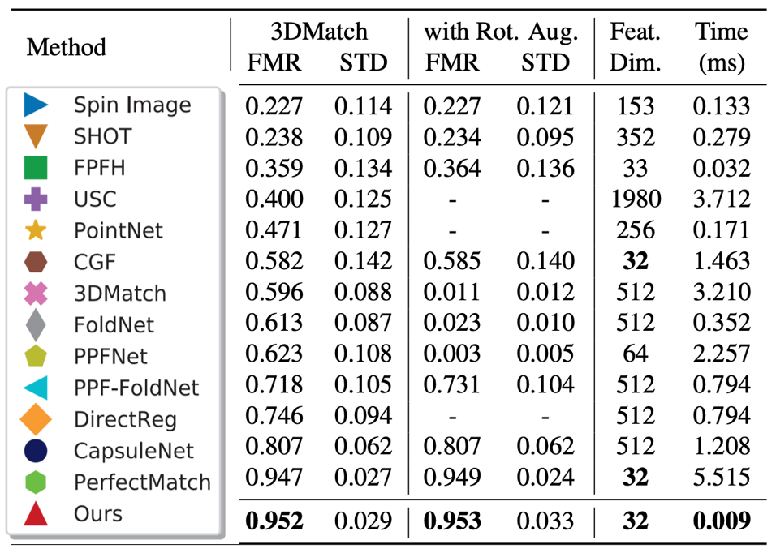
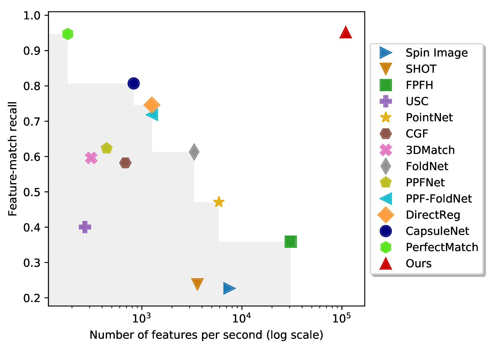

# Registration of point clouds using Convolutional Neural Networks

## A brief explanation of the project

This is a student project on the registration of point clouds based on Convolutional Neural Networks.

FCGF stands for "Fully Convolutional Geometric Features". It is a method for generating point-wise features for point cloud data that are rotation and translation invariant, and that can be used for tasks such as point cloud registration, classification, and segmentation.

One of the advantages of FCGF is that it does not rely on hand-crafted geometric features, which can be difficult to design for complex point cloud shapes. Instead, the method learns the features directly from the data using deep learning techniques. This makes it more flexible and adaptable to a wide range of point cloud data.

FCGF (Fully Convolutional Geometric Features) is designed to be architecture-agnostic and can work with any convolutional neural network (CNN) as a feature extractor. In the original paper, the authors used the PointNet architecture to extract features, but FCGF can be also used with other architectures. In this implementation a CNN architecture called ResUNet is used.

ResUNet is a neural network architecture that combines the idea of residual networks (ResNets) and U-nets. ResNets use residual blocks to allow for the successful training of very deep neural networks, while U-nets are commonly used for segmentation tasks in biomedical image analysis. By combining these two architectures, ResUNet is able to effectively learn features at different levels of abstraction while preserving fine-grained details.

In the context of the FCGF model, ResUNet is used to extract features from the point cloud data, which are then used to perform geometric matching and registration tasks. 

For the registration of two point clouds we use the ICP (Iterative Closest Point) algorithm. The algorithm finds corresponding points in two point clouds, estimates a rigid transformation that aligns the moving point cloud to the fixed point cloud, and iteratively refines the transformation until convergence. The overall idea of ICP is to minimize the distance between the corresponding points in the two point clouds.

FCGF was introduced in a paper called "Fully Convolutional Geometric Features" by Panos Achlioptas, Olga Diamanti, Ioannis Mitliagkas, and Leonidas Guibas, which was presented at the Conference on Computer Vision and Pattern Recognition (CVPR) in 2019.


## Requirements

- Ubuntu 20.04 or higher
- CUDA 11.8 or higher
- Python v3.7 or higher
- Pytorch v2.0.0 or higher
- [MinkowskiEngine](https://github.com/stanfordvl/MinkowskiEngine) v0.5.4


## Setting up the requirements

The project was implemented on Google Colab. To set up the project open the Jupyter Notebook (FCGF.ipynb) and follow the steps.

## Fully Convolutional Geometric Features, ICCV, 2019

Extracting geometric features from 3D scans or point clouds is the first step in applications such as registration, reconstruction, and tracking. State-of-the-art methods require computing low-level features as input or extracting patch-based features with limited receptive field. In this work, we present fully-convolutional geometric features, computed in a single pass by a 3D fully-convolutional network. We also present new metric learning losses that dramatically improve performance. Fully-convolutional geometric features are compact, capture broad spatial context, and scale to large scenes. We experimentally validate our approach on both indoor and outdoor datasets. Fully-convolutional geometric features achieve state-of-the-art accuracy without requiring prepossessing, are compact (32 dimensions), and are 600 times faster than the most accurate prior method.

[ICCV'19 Paper](https://node1.chrischoy.org/data/publications/fcgf/fcgf.pdf)

## 3D Feature Accuracy vs. Speed

|   Comparison Table           | Speed vs. Accuracy |
|:----------------------------:|:------------------:|
|    |  |

Feature-match recall and speed in log scale on the 3DMatch benchmark. FCGF is the most accurate and the fastest. The gray region shows the Pareto frontier of the prior methods, where is represented FCGF (red triangle) as a nadir point, the pareto optimal solution.


## Reading material

- 2020-10-02 Measure the FCGF speedup on v0.5 on [MinkowskiEngineBenchmark](https://github.com/chrischoy/MinkowskiEngineBenchmark). The speedup ranges from 2.7x to 7.7x depending on the batch size.
- 2020-09-04 Updates on ME v0.5 further speed up the inference time from 13.2ms to 11.8ms. As a reference, ME v0.4 takes 37ms.
- 2020-08-18 Merged the v0.5 to the master with v0.5 installation. You can now use the full GPU support for sparse tensor hi-COO representation for faster training and inference.
- 2020-08-07 [MinkowskiEngine](https://github.com/NVIDIA/MinkowskiEngine) v0.5 improves the **FCGF inference speed by x2.8** (280% speed-up, feed forward time for ResUNetBN2C on the 3DMatch kitchen point cloud ID-20: 37ms (ME v0.4.3) down to 13.2ms (ME v0.5.0). Measured on TitanXP, Ryzen-3700X).
- 2020-06-15 [Source code](https://github.com/chrischoy/DeepGlobalRegistration) for **Deep Global Registration, CVPR'20 Oral** has been released. Please refer to the repository and the paper for using FCGF for registration.

## Related Works

3DMatch by Zeng et al. uses a Siamese convolutional network to learn 3D patch descriptors.
CGF by Khoury et al. maps 3D oriented histograms to a low-dimensional feature space using multi-layer perceptrons. PPFNet and PPF FoldNet by Deng et al. adapts the PointNet architecture for geometric feature description. 3DFeat by Yew and Lee uses a PointNet to extract features in outdoor scenes.

Our work addressed a number of limitations in the prior work. First, all prior approaches extract a small 3D patch or a set of points and map it to a low-dimensional space. This not only limits the receptive field of the network but is also computationally inefficient since all intermediate representations are computed separately even for overlapping 3D regions. Second, using expensive low-level geometric signatures as input can slow down feature computation. Lastly, limiting feature extraction to a subset of interest points results in lower spatial resolution for subsequent matching stages and can thus reduce registration accuracy.

## Related Projects

- A neural network library for high-dimensional sparse tensors: [Minkowski Engine, CVPR'19](https://github.com/StanfordVL/MinkowskiEngine)
- Semantic segmentation on a high-dimensional sparse tensor: [4D Spatio Temporal ConvNets, CVPR'19](https://github.com/chrischoy/SpatioTemporalSegmentation)
- The first fully convolutional metric learning for correspondences: [Universal Correspondence Network, NIPS'16](https://github.com/chrischoy/open-ucn)
- 3D Registration Network with 6-dimensional ConvNets: [Deep Global Registration, CVPR'20](https://github.com/chrischoy/DeepGlobalRegistration)


## Projects using FCGF

- Gojcic et al., [Learning multiview 3D point cloud registration, CVPR'20](https://arxiv.org/abs/2001.05119)
- Choy et al., [Deep Global Registration, CVPR'20 Oral](https://arxiv.org/abs/2004.11540)


```
@inproceedings{FCGF2019,
    author = {Christopher Choy and Jaesik Park and Vladlen Koltun},
    title = {Fully Convolutional Geometric Features},
    booktitle = {ICCV},
    year = {2019},
}
```